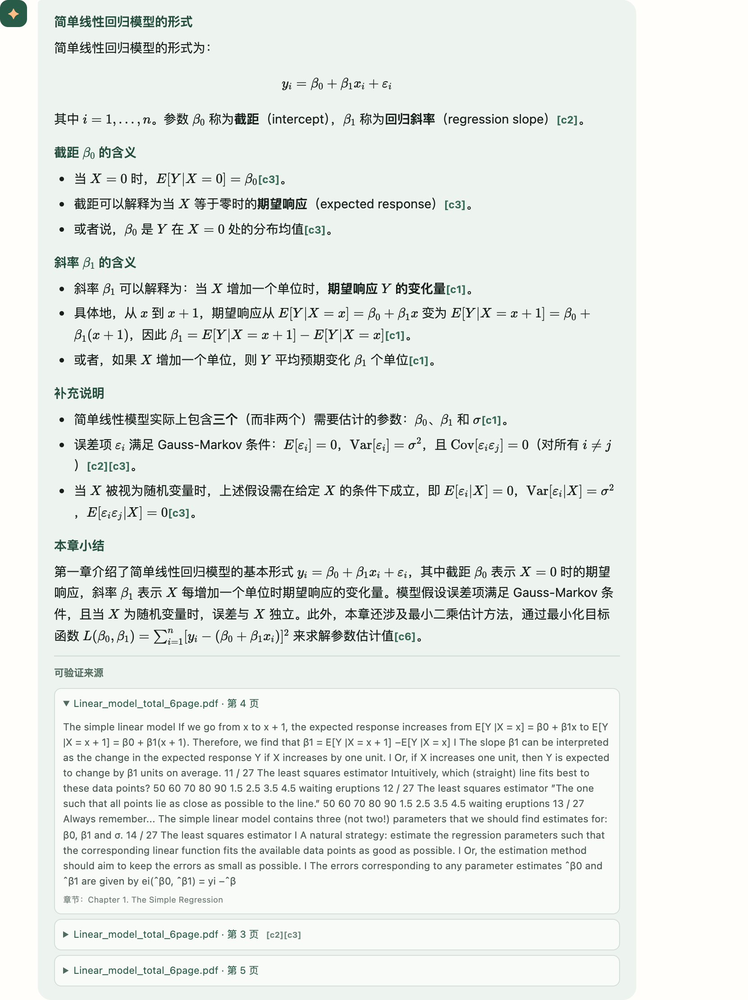
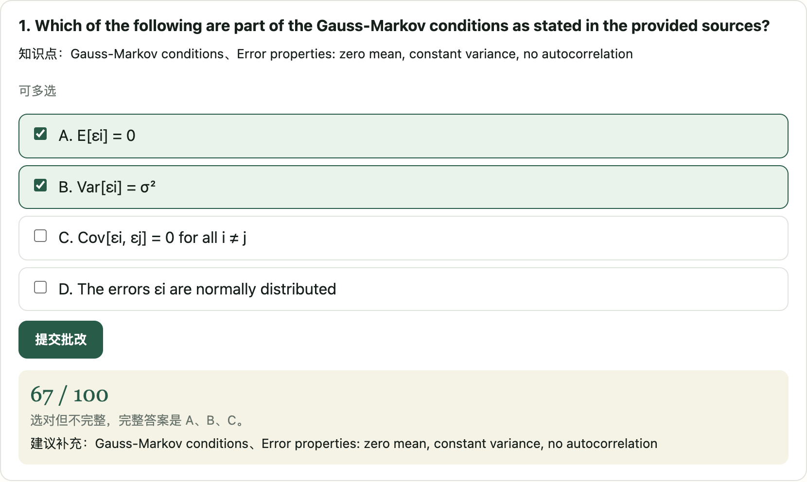
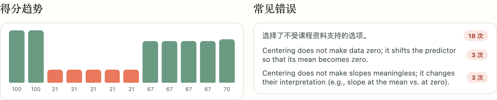
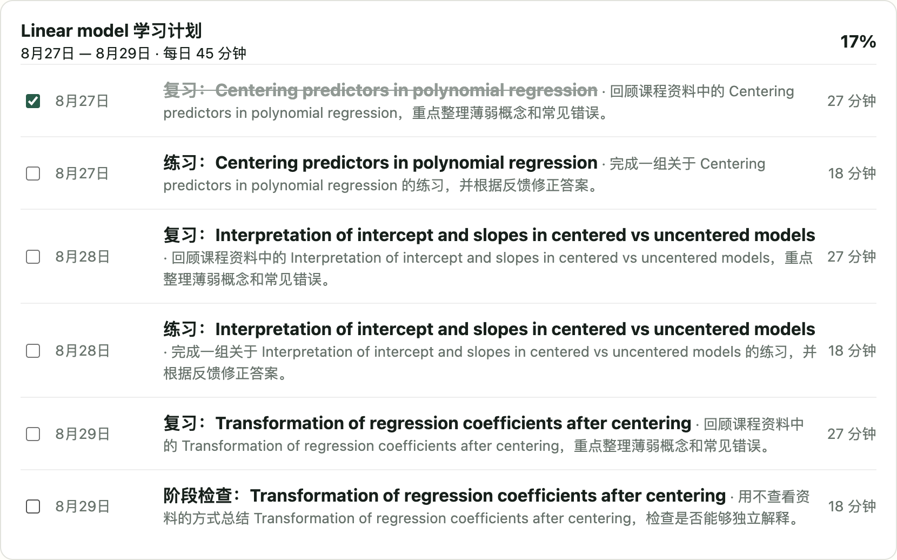

# StudyPilot

面向国际研究生的双语 AI 学习教练。上传课程资料，StudyPilot 只依据这些资料带引用地讲解概念、生成可批改的练习、按 rubric 逐条评分，并根据实际掌握度安排复习计划。

**核心约束：不使用通识知识补齐资料未覆盖的内容。** 资料里没有的，它会说没有，而不是凭印象作答。

[English](README.en.md)

产品定位、用户场景、核心流程、边界与验收标准见 [产品需求文档（PRD）](docs/PRD.md)。

---

## 界面

**带引用的讲解** —— 数学公式渲染为 LaTeX，行内 `[c1]` 标号对应下方来源，来源按页聚合、可展开原文并跳转到 PDF 对应页。



**练习与批改** —— 单选、多选、简答、概念解释四种题型，多选按 `(选对数 − 选错数) / 正确答案数` 给部分分。



**学习进度** —— 从历次作答汇总掌握度、得分趋势和高频错误。



**学习计划** —— 依据薄弱知识点和考试日期生成可勾选的每日任务。



---

## 快速开始

```bash
cp .env.example .env        # 填入模型密钥
docker compose up -d --build
```

- 学习工作台：<http://localhost:8000/>
- API 文档：<http://localhost:8000/docs>

不配置模型密钥也能跑通上传、解析、检索和引用链路 —— 此时返回可验证的检索结果而非生成式回答。配置后获得带 `[c1]` 引用的完整讲解：

```env
STUDYPILOT_ANTHROPIC_API_KEY=your_api_key
STUDYPILOT_ANTHROPIC_MODEL=claude-3-5-sonnet-20241022
```

---

## 能做什么

**资料**
- 创建课程、设置考试日期，上传 PDF / Markdown / TXT。
- 后台 Worker 异步解析、切分、嵌入并写入向量库，可查看处理进度。
- **自动识别资料自身的章节结构**：编号章节（`Chapter 3.` / `第三章`）、按标题页分册的讲义、Markdown 标题各用一套检测器，都识别不出时明确标记为「无结构」而不是猜一个出来。资料自己声明章号时以它为准 —— 从 `Chapter 0` 起头的教材，「第一章」仍然落到 `Chapter 1`。

**问答**
- 按课程、资料类型、指定文档、页码范围和章节隔离检索，支持「资料1」「第二份 PDF」这类指代。
- 回答带文件名与页码引用，引用可展开原文、跳转到 PDF 对应页。
- 中文提问、英文资料：提问会先翻译成资料语言再检索，回答语言可选中文 / 英文 / 中英对照。

**练习与批改**
- 生成带来源和 rubric 的单选、多选、简答、概念解释题，题目语言可与讲解语言分开设置。
- 按不可变 rubric 自动批改，给出逐项得分、错误定位和改进建议；选择题走确定性判分，不经模型。
- 练习历史、错题重练、评分要点与来源展示。

**学习管理**
- 汇总作答记录形成掌握度与薄弱知识点，据此生成可勾选的学习计划。
- 语言与讲解偏好设置，可查看并删除学习画像中的单个薄弱点。

**学术诚信**
- 四级确定性判定：作业代写与实时考试作弊不提供答案，但继续提供合规的学习帮助 —— 拒绝的是代做，不是学习。

---

## 架构

```text
统一聊天入口
  ↓
混合 LearningIntentRouter          规则优先；仅低置信度、模糊和复合请求调用 LLM
  ↓  RoutingDecision + QueryPlan
学术诚信 Guard                     四级判定，在任何 Agent 之前运行
  ↓
LearningAgentOrchestrator          按 execution_mode 分派，串行时传递上下文
  ├─ TutorAgent      课程问答与概念讲解
  ├─ QuizAgent       练习生成
  ├─ EvaluatorAgent  rubric 批改
  ├─ PlannerAgent    学习计划读取与生成
  └─ Progress / Catalog / General
  ↓
TeachingToolManager                9 个教学工具，统一做课程归属与资料范围校验
  ↓
AgentResult + AgentTrace
```

三条贯穿全局的设计约束：

- **用户显式选择的范围永远不会被模型覆盖。** 课程、资料、类型、页码、章节这些字段不进入模型输入，工具层还会校验资料确实属于该课程，越权返回 403。
- **范围只解析一次。** 意图与范围在路由层解析成结构化 `QueryPlan`，下游 Agent 与 Service 一律消费字段，不再对原始消息做正则解析 —— 否则同一句「第一章」会在三个地方得到三种理解。
- **规则优先。** 最常见的明确请求由确定性规则零延迟解决，实测 LLM 只在约 40% 的路由用例上被调用。

**检索**：`BAAI/bge-small-en-v1.5` 嵌入（384 维，ONNX 推理，随镜像分发，无需联网下载），分块 1200/200，融合打分 `0.7 × 向量分 + 0.3 × 词汇分`。跨语言不靠多语言嵌入，而是**先把提问翻译成资料语言再检索** —— 代价是一次小模型调用，收益是可以用更小更准的英文检索模型，且翻译错了肉眼可见，而嵌入对不上是黑箱。

**当前运行栈**：FastAPI + PostgreSQL + ChromaDB + Prometheus + Docker。后端入口 `app.main:app`，API 统一 `/api/v1` 前缀；前端为 FastAPI 托管的原生 HTML/CSS/JS 工作台。短期上下文和后台任务状态统一由 PostgreSQL 管理；未使用的 Redis 已移除，避免缓存一致性与额外运维成本。

**可观测性**：`/api/v1/metrics` 暴露低基数 Prometheus 指标，覆盖 HTTP 成功率与延迟、Router 决策来源、工作流完成/降级、Agent 步骤、教学工具成功率与延迟、RAG 证据状态、降级原因和 Tutor token。指标标签不包含用户、课程、资料、问题文本或 trace ID；聊天响应通过 `X-Trace-ID` 关联响应体中的完整 Agent Trace。

---

## 项目结构

```text
app/
├── main.py                     FastAPI 入口
├── api/v1/routes/              课程、资料、导师、练习、批改、进度、计划
├── agents/
│   ├── routing.py              RoutingDecision / QueryPlan 路由协议
│   ├── intent_router.py        混合意图路由（规则 + LLM 兜底）
│   ├── llm_router.py           结构化 LLM 路由
│   ├── protocol.py             AgentTask / LearningContext / AgentResult / AgentTrace
│   ├── orchestrator.py         多 Agent 编排
│   ├── learning_agents.py      八个 Agent 适配器
│   ├── tools.py                教学工具层与权限校验
│   ├── integrity.py            学术诚信四级 Guard
│   └── skills.py               教学 Skill 加载器
├── services/                   课程、文档、导师、练习、批改、进度、计划
├── rag/                        解析、章节识别、分块、嵌入、检索、查询翻译
├── infrastructure/             数据库、向量库、文件存储、仓储
└── web/                        学习者工作台

skills/                         七个教学 Skill（讲解、命题、批改、复习策略等）
tests/unit/                     332 个单元测试
tests/evals/                    十一套版本化离线评测与基线
migrations/                     Alembic 迁移
```

---

## 测试与评测

单元测试检查代码是否正确；`tests/evals/` 下的离线评测检查**模型行为是否忠于资料** —— 这是 LLM 应用里真正会出问题、而单元测试看不见的部分。

```bash
docker compose exec api python -m pytest tests/unit -q
```

十一套版本化评测集，各自记录了可比较的基线与合入门槛，详见 [tests/evals/README.md](tests/evals/README.md)：

| 评测集 | 规模 | 当前基线 | 需要模型 |
|---|---|---|---|
| Router v2 | 57 例 | Agent 准确率 98.1%、复合步骤识别 100%、澄清 100%、范围保持 100%（意图准确率 86.5%，差额几乎全为同 Agent 标签重叠） | 部分 |
| Integrity v1 | 61 例 | 全指标满分，假阳性率 0% | 否 |
| Orchestrator v1 | 30 例 | 全指标 100% | 否 |
| Loop v1 | 5 阶段 | 闭环成立，总延迟 22.5s | 是 |
| RAG v1 | 30 题 | 引用有效率 100%，范围遵循 100%，关键词覆盖 98% | 是 |
| Quiz v1 | 30 场景 | 预期行为成功 96.7%（含正确拒绝）；应生成场景成功 27/28 | 是 |
| Grading v1 | 10 题 × 三档 × 3 次 | 全指标 100% | 是 |
| Faithfulness v2 | 30 条人工评审 | 忠实度与引用准确率 100%、编造率 0%、资料外拒答 100% | 人工 |
| Cross-lingual v1 | 14 题 × 中英 | 跨语言持平率 100%，无引用不支撑 | 是 |
| Injection v1 | 10 类攻击 | 抵抗率 100%，信标泄漏 0% | 是 |
| Paraphrase v1 | 11 组 41 条 | 组内一致性 100%、意图准确率 100% | 部分 |

其中三套完全不调用模型，免费、秒级、逐位可复现，适合进 CI：

```bash
docker compose exec api python -m tests.evals.run_router_eval --rules-only
docker compose exec api python -m tests.evals.run_integrity_eval
docker compose exec api python -m tests.evals.run_orchestrator_eval
```

评测基线**如实记录当前行为，不通过修改数据集抬高数值**。指标本身也被反复修正过 —— 例如注入评测早期把「模型点名指出攻击并拒绝执行」判为失败，而一个惩罚正确行为的检测器比没有检测器更糟。这些更正都写在 `tests/evals/README.md` 里。

---

## 不在范围内

StudyPilot 只回答学习者上传的课程资料所覆盖的内容。**心理危机与情绪求助、医疗法律财务等专业建议、资料之外的事实性问题，都不在范围内，系统也不做识别** —— 这类场景需要专业训练与人工介入，本项目没有，因此明确不做，而不是做一个不可靠的版本。
