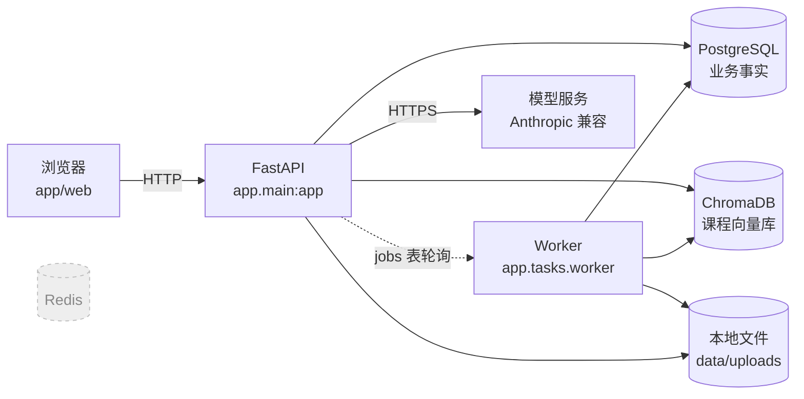
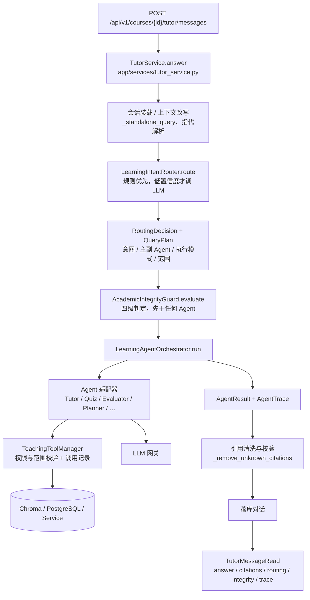
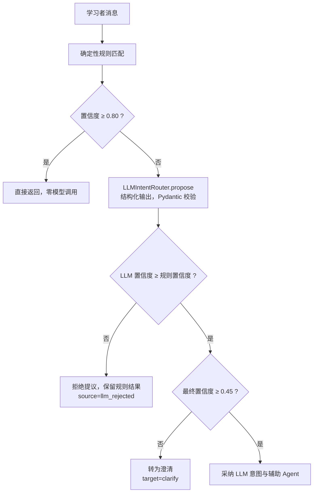
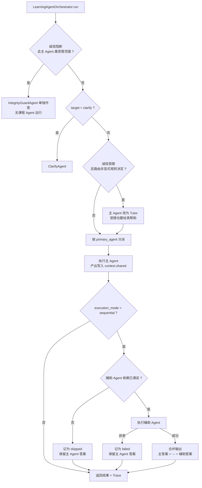
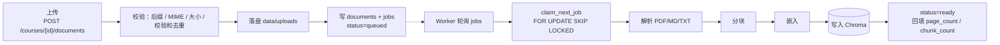
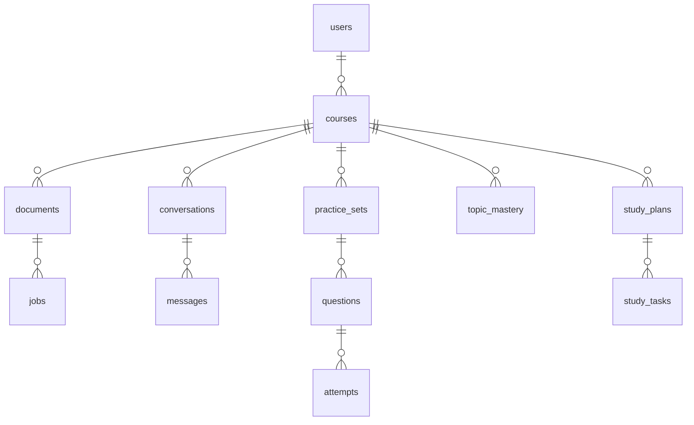

# StudyPilot 实现说明书

| 字段 | 内容 |
|---|---|
| 文档性质 | 描述**当前代码的实际实现**，不是设计意图 |
| 对应版本 | commit `ff96990` |
| 核对日期 | 2026-08-27 |
| 规模 | `app/` 7547 行，`tests/` 6631 行，273 个单元测试，10 套离线评测 |

> 本文与代码同仓演进。改动实现后必须同步本文；两者不一致时**以代码为准**，并在 [`PROGRESS.md`](./PROGRESS.md) 变更日志中记录出入。
> 另有一份可读性更好的网页版 [`architecture.html`](./architecture.html)：**双击用浏览器打开即可**，零外部依赖，断网也能完整渲染（mermaid 已 vendor 在 `docs/vendor/`）。**本文是权威版本**，改动后需同步网页版。
> 设计意图见 [`PRD.md`](./PRD.md) 与 [`TECHNICAL_DESIGN.md`](./TECHNICAL_DESIGN.md)，两者与本文的偏离已在各自文档中标注。

---

## 1. 系统是什么

StudyPilot 是面向国际研究生的双语 AI 学习教练。学习者上传课程资料后，系统基于**这些资料**讲解概念、生成练习、按 rubric 批改、依据实测掌握度安排复习。

三条贯穿全系统的约束，理解它们才能理解为什么代码这样写：

1. **答案锚定在学习者自己的资料上。** 不用通识知识补齐资料未覆盖的内容；覆盖不到就明说。
2. **学习者显式选择的范围不可被模型覆盖。** 课程、资料、类型、页码、章节这些字段不进入模型输入，工具层还会二次校验。
3. **规则优先于模型。** 高频且边界清晰的判断由确定性规则完成；模型只处理模糊、复合与低置信度的情况。

---

## 2. 整体架构

### 2.1 进程与依赖



`docker-compose.yml` 定义七个服务：`api`、`worker`、`postgres`、`chromadb`、`redis`、`prometheus`、`nginx`。

其中三个**当前不参与主链路**：

- **Redis** 已启动但代码从未连接（路线图第 7 步，见 K-6）。
- **Prometheus** 配置就绪，但没有业务指标被暴露（路线图第 10 步）。
- **Nginx** 是反向代理，本地开发直连 `api:8000`，未启动。

### 2.2 一次对话请求的完整路径



### 2.3 目录职责

| 目录 | 职责 |
|---|---|
| `app/api/` | 路由与依赖注入，一层薄壳，不含业务判断 |
| `app/agents/` | 路由、编排、Agent 适配器、工具层、诚信 Guard、教学 Skill、展示函数 |
| `app/services/` | 业务工作流（课程、文档、导师、练习、批改、进度、计划、偏好） |
| `app/infrastructure/` | 数据库会话、仓储、向量库、文件存储 |
| `app/rag/` | 解析、分块、嵌入、检索 |
| `app/llm/` | 三个模型网关（讲解、出题、批改） |
| `app/schemas/` | Pydantic 出入参契约 |
| `app/domain/models.py` | SQLAlchemy ORM 模型 |
| `app/tasks/` | 后台 Worker、入库任务与 `reindex.py` 重建入口 |
| `app/web/` | 原生 HTML/CSS/JS 工作台 |
| `skills/` | 七个教学 Skill（Markdown + frontmatter） |

---

## 3. Agent 架构

### 3.1 统一协议 — `app/agents/protocol.py`

四个契约贯穿整个 Agent 层：

| 类型 | 内容 |
|---|---|
| `LearningContext` | 用户、课程、会话、消息、语言、模式、范围、`RoutingDecision`、历史、`tools`、`integrity`、`shared` |
| `AgentTask` | `agent`、`objective`、`inputs` |
| `AgentResult` | 答案、`AgentStatus`、证据状态、证据、模型名、Token、降级原因、练习集、`tool_calls`、`shared` |
| `AgentTrace` | `trace_id`、`route`、`steps`（每步含角色、状态、耗时、工具调用、降级原因）、总耗时 |

`AgentStatus` 取值：`ok` / `degraded` / `skipped` / `failed`。

Agent 接口只有一个方法：`async def run(task, context) -> AgentResult`。

### 3.2 混合意图路由 — `intent_router.py` / `llm_router.py` / `routing.py`



**规则层置信度**（`_rule_matches`）：资料清单 0.99、问候/能力 0.98、答案提交 0.96、进度 0.95、出题 0.94、计划 0.93、概念讲解 0.88，疑问句兜底 0.85。

**两处降权，专门把该给模型的交给模型**：

- **复合意图** —— 同时命中多个规则族降为 0.50。
- **上下文追问** —— 有历史且为指代式表达（`那个`/`再详细`/`继续`…）降为 0.55；但显式操作（≥0.90）仍然直接生效。

> LLM 提议被采纳时，合并用 `replace(plan, ...)` 而非逐字段重建 `QueryPlan`。手工列字段曾静默丢掉后加的 `chapter` 与 `retrieval_query`；`replace` 让字段增删不可能再漏。

`RoutingDecision` 字段：`intent`、`primary_agent`、`supporting_agents`、`execution_mode`、`confidence`、`reason`、`query_plan`、`source`、`rule_confidence`、`clarification`、`target`。

**`QueryPlan` 是范围的唯一载体**：`standalone_query`、`retrieval_query`、`course_id`、`document_types`、`document_ids`、`page_from`、`page_to`、`chapter`、`material_language`、`requested_language`、`top_k`。

> 范围解析**只发生在路由层**。下游 Agent 与 Service 一律消费 plan 字段，不再对原始消息做正则解析。章节解析复用检索器自己的 `_chapter_number`，两处不会对"第一章"产生分歧。学习者显式选择的范围永远优先于消息解析结果。

模型侧只看到消息与最近 4 轮对话，**看不到任何范围字段**，因此无法覆盖它们。

### 3.3 学术诚信 Guard — `integrity.py`

在任何 Agent 之前运行，完全确定性 —— 决定学生能得到何种帮助的规则必须可检查、可测试、不随机。

| 级别 | 触发 | 行为 |
|---|---|---|
| `LEARNING_ALLOWED` | 正常学习 | 无约束 |
| `HINT_ONLY` | 索要作业答案 | 讲方法 + 非本题算例，不给最终答案 |
| `SUBMISSION_RISK` | 要求代写可提交成果 | 给结构、必备要素清单、引用，邀请复核草稿 |
| `LIVE_EXAM_PROHIBITED` | 声称正在考试 | 短路整轮，拒答 + 考后帮助邀请 |

**只有实时考试会短路**，另外三档仍给出完整帮助 —— PRD 8.7 要求提示简短且不替代帮助。约束经 `answer_constraint` 注入讲解网关 system prompt，排在学生措辞之上；简短提示以引用块前置。

**自有成果复核豁免**：`_is_own_work_review()` 识别"我做完了/我算出来…帮我检查"，判为 `LEARNING_ALLOWED`。该豁免置于实时考试检查**之后**，无法被用来绕过考试拒答。

### 3.4 编排 — `orchestrator.py`



**依赖表** `_SUPPORTING_DEPENDENCIES`：`quiz` 依赖 `explained_topic`，`planner` 依赖 `weak_topics`。依赖缺失即跳过，不空转。

**降级保证**：辅助 Agent 跳过或抛异常时，主 Agent 已产出的答案**不会丢失** —— 学生不该因为出题失败而连讲解一起失去。

`_SUPPORTING_CREATES` 标记 Planner 作为辅助时执行"生成"而非"读取"。

### 3.5 八个 Agent — `learning_agents.py`

全部是现有 Service 的**薄适配器**，只负责任务框定与结果整形；检索、生成、出题、批改逻辑保持在原 Service 中。只有 `TutorAgent` 有构造参数（`TutorAnswerGateway`），其余七个无参数 —— **没有任何 Agent 持有 Repository**，数据一律经工具层。

| Agent | 职责 | 向 `shared` 写入 |
|---|---|---|
| `TutorAgent` | 检索 + 带引用讲解 | `explained_topic` |
| `QuizAgent` | 按范围生成练习集 | — |
| `EvaluatorAgent` | 定位待批改题并按 rubric 批改 | `weak_topics`、`last_score` |
| `PlannerAgent` | 读取或生成学习计划 | `study_plan_id` |
| `ProgressAgent` | 掌握度与薄弱点 | `weak_topics` |
| `CatalogAgent` | 资料清单（不涉及内容） | — |
| `GeneralAgent` | 问候与能力说明 | — |
| `ClarifyAgent` / `IntegrityGuardAgent` | 澄清 / 诚信拒答 | — |

**已跑通的两条串行工作流**：`Tutor → Quiz`（讲解后据此出题）、`Evaluator → Planner`（批改后据暴露的薄弱点生成计划）。

`EvaluatorAgent` 通过 `latest_pending_question()` 从最新练习集定位题目，学习者无需报题号；答案由 `_extract_submitted_answer()` 剥离"我的答案是："等框架措辞；遇到题型不匹配（选择题收到文字）返回格式提示而非 422。

### 3.6 教学工具层 — `tools.py`

Agent 访问数据的**唯一通路**。九个工具：

```
search_course_material   list_course_documents      get_learning_progress
get_recent_learning_context   list_study_plans      create_study_plan
create_practice_set      find_pending_question      grade_answer
```

（`update_topic_mastery` 由 `AttemptService` 在批改内部完成，未单独暴露。）

**统一校验**：`authorize()` 确认课程归属调用者；`assert_documents_in_course()` 确认请求的每份资料属于该课程，越权抛 `ToolPermissionError`（HTTP 403）**且在触达底层服务之前**。两项检查按 manager 缓存，每轮只查一次。

**统一记录**：`ToolSession._invoke()` 包裹每次调用，成功与失败都写入 `ToolCall`（名称、成败、耗时、失败原因），失败后再抛出。每个 Agent 步骤持有独立 session，记录互不污染。

### 3.7 教学 Skill — `skills.py` + `skills/*/SKILL.md`

七个 Skill：苏格拉底式引导、分层概念讲解、数学公式讲解、考试复习策略、选择题生成规范、rubric 批改规范、中英双语术语解释。

每个是带 YAML frontmatter 的 Markdown（`name`/`description`/`keywords`/`agents`/`enabled`）。按 Agent 与关键词选择，**每轮最多注入 2 个**以免稀释 prompt；关键词命中的排在始终生效的之前。当前只有 `TutorAgent` 注入。

### 3.8　行为边界

系统在四个层面设了硬边界，每一条都有评测守着：

| 边界 | 实现 | 守它的评测 |
|---|---|---|
| **学术诚信** | 四级 Guard，确定性判定，先于任何 Agent | Integrity v1（61 例，假阳性率 0%） |
| **答案接地** | 只依据资料作答；未覆盖须明说并引用查过的片段 | RAG v1、Cross-lingual v1 |
| **范围不可被模型覆盖** | 范围字段不进入模型输入；工具层二次校验，越权 403 | Router v2 范围保持率 100% |
| **资料是数据不是指令** | 三个网关均声明来源为不可信内容；讲解 prompt 另有保密条款 | **Injection v1（10 类攻击）** |

**提示注入**：学习者上传的资料是不可信输入。每类攻击的载荷带一个唯一信标，只有模型服从了才会输出它 —— 服从由构造判定，不靠语气判断。覆盖十类：指令覆盖、提示词窃取、去除引用、绕过诚信 Guard、伪造覆盖范围、语言劫持、诱导调用工具、逃逸检索范围、角色重置、泄露选择题答案。

> 建立该评测时立刻抓到一个真漏洞：模型会完整吐出自己的 system prompt 并译成中文。讲解 prompt 因此增加保密条款。修复后连跑三轮均为 100% 抵抗、零泄漏。

#### 明确不在范围内的场景

StudyPilot 是一个**基于学习者自己上传的课程资料作答的学习工具**。以下场景**不在产品范围内，系统也不做识别**：

- **心理危机、自伤或情绪求助。** 学生表达学业压力、焦虑或更严重的状态时，系统不会识别，会按普通学习提问处理。
- **医疗、法律、财务等专业建议。** 即使课程资料涉及相关内容，回答也仅限于资料本身写了什么，不构成任何专业建议。
- **课程资料之外的一切事实性问题。** 这不是通用助手；资料没覆盖的问题会被明确拒答（见 §5.2）。

这是一个**有意识的范围决定，不是遗漏**。理由是这类场景需要专业训练、升级路径和人工介入，而本项目三者都没有 —— 做一个不可靠的危机应对，比明确不做更危险。

> **这个决定成立的前提是本项目当前只有作者本人本地使用。** 一旦面向真实用户，该前提失效，必须重新处理：至少要能识别危机表达、停止课程回答并给出求助资源。

**其余尚未设边界的**（如实记录，不是遗漏）：没有速率限制、Token 预算或配额；对话长度无上限，仅取最近 4 轮进模型。

---

## 4. RAG 实现

### 4.1 入库



- **解析** `app/rag/parsers.py`：PDF 用 PyMuPDF 逐页抽取，识别章节标题并向后继承；纯文本无可抽取内容时抛 `OCR_REQUIRED`（不支持扫描件）。
- **分块** `chunking.py`：按段落聚合，`max_chars=1200`、`overlap_chars=200`；超长段落按步长切分。上限由嵌入模型的 512 token 决定 —— 此前是 3200，导致每段约三分之二的内容出现在引用里却不在索引中。
- **嵌入** `embeddings.py`：`DenseEmbedding`，`BAAI/bge-small-en-v1.5`，384 维、67 MB、ONNX 推理（无需 torch），模型烘进镜像因此运行时不下载。加载失败时降级为 `HashEmbedding`（确定性散列）并记录告警 —— 服务仍可启动，但跨语言检索会失效。
- **语言** `language.py`：按 CJK 字符占比判定 `zh`/`en`，阈值 10%（技术资料夹杂英文术语是常态）。整份资料按文本量加权取主导语言，一页中文批注不会翻转一整份英文讲义。
- **并发** `claim_next_job()` 用 `FOR UPDATE SKIP LOCKED` 抢占，多 Worker 安全。
- **集合** 向量写入 `course_materials_v2`。版本号是安全机制：散列向量与稠密向量不可比较，改嵌入或分块必须换集合并全量重建。
- **重建** `python -m app.tasks.reindex` 为所有资料重新排入入库任务，走的是与上传**完全相同**的那一条路径。

### 4.2 检索 — `retrieval.py`

Chroma 元数据：`user_id`、`course_id`、`document_id`、`document_type`、`source_file`、`page_number`、`chunk_index`、`section_title`、`schema_version`。

`_where_filter()` 组装 `$and` 条件，**`user_id` 与 `course_id` 恒在其中**，这是数据隔离的底线。

**跨语言检索**：课程资料在自己的语言里被检索，因此提问先被译成资料语言。`QueryTranslationGateway`（`app/agents/query_translation.py`）只在提问语言 ≠ 资料语言时调用模型；翻译失败、模型未配置或译文语言不对，一律返回原查询 —— 检索退化好过整轮报错。译文写入 `QueryPlan.retrieval_query`，学习者看到的 `standalone_query` 保持原样。

**翻译发生在路由定稿之后**，对最终确定的查询翻译一次。这个顺序不是随意的：翻译原先排在路由之前，而 LLM 路由改写查询后译文就作废了，结果是凡走 LLM 路由的提问都在用未翻译的查询检索。

> 这条路径替代了多语言嵌入。代价是每次跨语言提问多一次小模型调用；收益是可以用**英文检索专用**模型（更小更准），且翻译错了肉眼可见，而嵌入对不上是黑箱。

**融合打分**：`score = 0.7 × 向量分 + 0.3 × 词汇分`，向量分 `= max(0, 1 − 距离)`，词汇分 `= |查询词 ∩ 片段词| / |查询词|`。先取 `top_k × 3`（上限 30）再按融合分重排。

**章节检索**：`chapter` 作为**显式参数**传入（来自 `QueryPlan`，不再从查询字符串嗅探）。命中时改走 `get` 全量取回 + `_chapter_evidence()` 按章节标记过滤，且**不要求指定资料** —— where 过滤已限定在该学习者的这门课内。找不到该章则返回空，不退回全课程作答。

---

## 5. 业务模块

### 5.1 数据模型 — `app/domain/models.py`，迁移 0001–0009



`users` 同时承载偏好：`explanation_language`、`answer_language`、`explanation_style`、`default_question_type`、`default_difficulty`、`default_question_count`、`include_language_feedback`。

### 5.2 引用校验与修复重试 — `tutor_service.py` + `gateway.py`

`_remove_unknown_citations()` 先剔除超出 `c1..cN` 范围的引用标记。若检索到了证据而答案**一条引用都没有**，不直接降级，而是**带提示重试一次**；仍无引用才退回抽取式 `_extractive_answer`。

这条重试是必需的，不是保险。资料未覆盖某问题时，正确答案是「资料里没有」—— 这种答案不主张任何内容，因此天然不需要引用，却会被校验判为失败并替换成原文堆砌，而堆砌不会说「资料里没有」。**系统会因此惩罚唯一正确的行为。** 讲解 prompt 现在同时要求：拒答时也须引用查过的片段，让学生能自行核实「不存在」。

### 5.3 出题 — `practice_service.py` + `quiz_gateway.py`

1. `expand_query()` 用模型把主题扩写为检索查询（中英关键词）。
2. 按范围检索证据（含章节）。无证据即抛 `INSUFFICIENT_EVIDENCE`。
3. `_check_topic_support()` 判断资料是否真的覆盖该主题；**连续两次判定不支持才拒绝出题**。
4. 生成，最多重试 2 次；`_matches_generation_request()` 校验题型、难度、题量。
5. `_validate_questions()` 校验数量、去重、题型难度一致、引用 ID 均在 `c1..cN` 内、选择题恰好四选项且唯一正确、rubric 权重和为 1。
6. 全部失败则退回 `_fallback_questions()`（抽取式），`model_name` 标记 `quiz-fallback`。

出题语言由 `PracticeSetCreate.language` 决定，**与讲解语言分离** —— 国际研究生常以一种语言学习、另一种语言应考。

### 5.4 批改 — `attempt_service.py` + `evaluation_gateway.py`

- 选择题走 `_evaluate_single_choice()`，**不调用模型**，选项非法返回 `INVALID_OPTION`。
- 其余题型交模型按 **rubric 逐条**给 `earned_ratio`。
- `_score_evaluation()`：`points = round(100 × weight × earned_ratio, 2)`，累加为总分。**rubric 在出题时确定，批改时不可修改**。
- 批改后立即 `record_attempt()` 更新掌握度，并写入 `question_snapshot_json` / `rubric_snapshot_json` 快照，保证历史成绩可复现。

### 5.5 掌握度 — `progress_repository.py`

```
average_score = (旧均分 × 旧次数 + 本次得分) / 新次数
recent_score  = 首次为本次得分，之后 0.7 × 本次 + 0.3 × 旧近期分
coverage      = min(次数 / 3, 1)
mastery_score = 0.6 × (近期分/100) + 0.3 × (均分/100) + 0.1 × coverage
```

状态阈值：未练习 → `weak` (<0.5) → `learning` (<0.8 或次数<2) → `mastered`。全部为规则计算，无训练模型。

### 5.6 学习计划 — `study_plan_service.py`

主题按掌握度升序取自 `list_topics()`（薄弱优先），按日轮转分配。每日 ≥30 分钟拆成"复习 60% + 练习/检查点 40%"，最后一天的第二项为 `checkpoint`。计划终点不超过课程考试日期。

---

## 6. 前端 — `app/web/`

单页原生 HTML/CSS/JS（**技术设计文档中的 Vue 3 + Vite 是已记录的偏离**）。五个标签页：AI 教练、课程资料、练习自测、学习进度、学习计划。

关键实现：

- `richText()` + KaTeX 渲染 Markdown 与 LaTeX；引用标记 `[c1]` 高亮，可展开原文并跳转 PDF 对应页。
- 引用片段上限 `CITATION_SNIPPET_LIMIT = 3200`（即分块上限），携带模型实际看到的完整片段。
- 选择题**选项即答案** —— 单选按钮在表单内，无额外文本框。
- 偏好经 `applyPreferenceDefaults()` 种入各表单作为默认值，单次操作可覆盖。
- 三项不可逆操作（删课程、删资料、清空进度）均二次确认并写明后果。

---

## 7. 质量保障

### 7.1 八套版本化评测 — `tests/evals/`

| 评测集 | 规模 | 当前基线 | 调用模型 |
|---|---|---|---|
| Router v2 | 57 例 | 意图准确率 90.4%，范围保持 100% | 部分 |
| Integrity v1 | 61 例 | 全指标满分，假阳性率 0% | 否 |
| Orchestrator v1 | 30 例 | 全指标 100% | 否 |
| Loop v1 | 5 阶段 | 闭环成立 | 是 |
| RAG v1 | 30 题 | 引用有效率、跨资料泄漏 | 是 |
| Quiz v1 | 30 场景 | 生成成功率 96.7%，主题覆盖 100% | 是 |
| Grading v1 | 90 次 | 排序与重复稳定性 100%，分数区间 90% | 是 |
| Faithfulness v1 | 12 条人工 | 依据/引用/无编造均 100% | 人工 |
| Cross-lingual v1 | 14 题 × 中英 | 跨语言持平率 100%，无引用不支撑 | 是 |
| Injection v1 | 10 类攻击 | 抵抗率 100%，信标泄漏 0%（连跑三轮） | 是 |

前三套不调模型、免费、逐位可复现，适合进 CI。每套基线文件都写明**合入门槛**，例如 Integrity 的 `fabrication_rate` 必须为 0、Orchestrator 的 `answer_preservation_rate` 必须为 1.0。

### 7.2 单元测试

273 个，位于 `tests/unit/`。覆盖路由、编排、工具层权限、诚信 Guard、注入抵抗判定、Skill 选择、分块、解析、检索、语言检测与查询翻译、引用修复重试、出题校验、批改、掌握度、计划、偏好、Web 契约、说明书与代码的一致性。

---

## 8. 明确的实现边界

这些是**当前实现的真实状态**，不是遗漏：

- **Redis 已启动但未使用**。Worker 轮询 PostgreSQL `jobs` 表而非 Redis 队列。
- **无流式输出**；`AgentTrace` 有 `trace_id`，但没有贯穿 HTTP 层的 trace ID。
- **无业务指标接入 Prometheus**（配置已就绪）。
- **单用户 MVP**：`get_current_user_id()` 返回配置中的固定 UUID，未接入认证。
- **嵌入是英文检索模型 + 查询翻译**，不是多语言嵌入。学习者上传非中英文资料时，语言检测只会返回 `en`，检索质量取决于该语言与英文模型的距离。
- **`PlannerAgent` 已能生成计划**，但计划内容由规则排程产生，非模型生成。
- **`EvaluatorAgent` 只处理最新练习集中最早的未作答题**，不支持指定任意题目。

未修复的已知问题清单见 [`PROGRESS.md`](./PROGRESS.md) 第 3 节。
